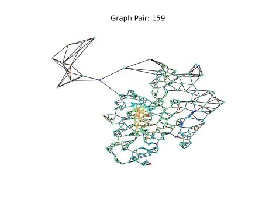
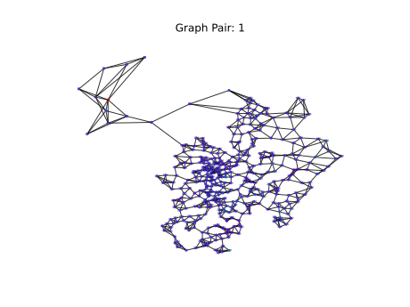
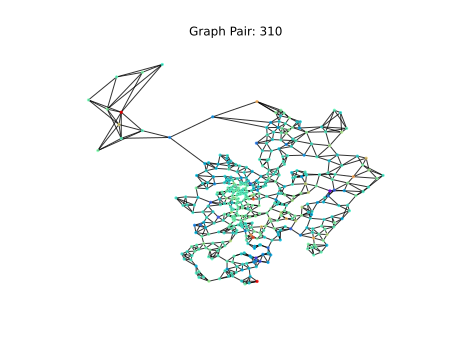
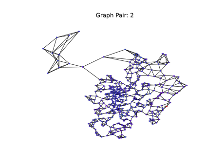

[TOC]


# MGC-RM

## GAT

GAT（Graph Attention Networks，图注意力网络）是一种图神经网络（GNN）的变体，它通过引入自适应权重分配机制来改进传统的图卷积网络（GCN）。GAT 通过学习邻居节点之间的注意力系数来动态地聚合邻居的信息，从而更好地捕捉图中节点之间的关系（**某种节点表示，对自己的表示中有权重的考虑邻居节点**）。

### GAT 的核心思想

GAT 的核心思想在于通过注意力机制为每个节点的不同邻居分配不同的权重，这样可以更加灵活地处理不同节点的重要性。具体来说，GAT 的关键步骤包括：

1. **初始化**：每个节点都有自己的特征表示（通常是特征向量）。
2. **注意力机制**：通过计算注意力系数（attention coefficients）来**决定邻居节点的重要性**。
3. **聚合**：根据注意力系数加权**聚合**邻居节点的信息。
4. **更新**：使用聚合的信息来**更新每个节点的特征表示**。

### GAT 的数学描述

以下是 GAT 的数学描述：

#### 1. 初始化

假设有图 \( $G = (V, E)$ \)，其中 \( $V$ \) 是节点集，\( $E$ \) 是边集。每个节点 \($v_i$\) 有一个特征向量 \( $\mathbf{h}_i $\)。

#### 2. 注意力机制

定义注意力系数 \( $\alpha_{i,j}$ \)，它是节点 \($ v_i $\) 和 \($v_j$\) 之间的关系强度的度量。GAT 使用共享的注意力机制 \($\alpha$\) 来计算注意力系数：

[$e_{ij}=\text{LeakyReLU} (\mathbf{a}^T [\mathbf{Wh}_i || \mathbf{Wh}_j]) $]

 ==单层的全连接层，表示一种：一对向量到一个标量的映射，表示两个向量的相关度==

其中：

- \( $\mathbf{a}$ \) 是一个可学习的向量，用于计算注意力分数。
- \( $\mathbf{W}$ \) 是一个权重矩阵，用于变换节点特征。
- \( $||$ \) 表示特征向量的拼接（concatenation）。
- \( $e_{ij} $\) 是未归一化的注意力分数。

接下来，对每个节点 \( $v_i$ \) 的邻居节点计算注意力系数：

\[ $\alpha_{ij} $= $\frac{\exp(e_{ij})} {\sum_{k \in \mathcal{N}(i)} \exp(e_{ik})} $\]  ==针对一个节点，其邻居对其的权重系数 。所有邻居归一化处理，分配权重 softmax用于归一化==

其中 \( $\mathcal{N}(i)$ \) 是节点 \( $v_i$ \) 的邻居集。

#### 3. 聚合

使用注意力系数加权聚合邻居节点的信息：

\[ $\mathbf{h}_i^{'} = \sigma \left( \sum_{j \in \mathcal{N}(i)} \alpha_{ij} \mathbf{W} \mathbf{h}_j \right)$ \]

其中 \( $\sigma$ \) 是激活函数，如 $ReLU$。

#### 4. 更新

更新节点 \($ v_i $\) 的特征表示：

\[ $\mathbf{h}_i^{'} = \text{Concat}(\mathbf{h}_i^{(1)}, \mathbf{h}_i^{(2)}, \ldots, \mathbf{h}_i^{(K)}) $\]

这里 \( $K$ \) 是注意力头的数量，通常使用多头注意力机制来增强模型的表达能力。

> 内积表示向量的相似度

### 点积表示相关性

在 GAT（Graph Attention Networks）中，$LeakyReLU(\mathbf{a}^T [\mathbf{Wh}_i || \mathbf{Wh}_j])$ 用于计算两个节点 \( $v_i $\) 和 \( $v_j$ \) 之间的注意力系数。这个表达式实际上是一个自定义的函数，用于衡量两个节点之间的相似度或相关性。下面详细解释一下各个组成部分及其意义：

#### 解释各个组成部分

1. **\($\mathbf{Wh}_i$\) 和 \($\mathbf{Wh}_j$\)**：
   - \($\mathbf{W}$\) 是一个权重矩阵，用于将原始节点特征向量 \($\mathbf{h}_i$\) 和 \($\mathbf{h}_j$\) 转换成新的特征表示。
   - \($\mathbf{Wh}_i$\) 和 \($\mathbf{Wh}_j$\) 分别表示节点 \( $v_i$ \) 和 \( $v_j$ \) 在经过线性变换后的特征向量。

2. **\([$\mathbf{Wh}_i$ $||$ $\mathbf{Wh}_j$]\)**：
   - \(||\) 表示向量拼接（concatenation）操作，即将两个向量合并成一个新的向量。这样做是为了保留两个节点的特征信息，并通过拼接后的向量来计算它们之间的关系。
   - 例如，如果 \($\mathbf{Wh}_i$\) 和 \($\mathbf{Wh}_j$\) 都是 \(d\)-维向量，则 \([$\mathbf{Wh}_i $$||$ $\mathbf{Wh}_j$]\) 将是一个 \(2d\)-维向量。

3. **\($\mathbf{a}^T$\) 和 \($\mathbf{a}$\)**：
   - \($\mathbf{a}$\) 是一个可学习的向量，用于衡量两个节点特征向量的相似度或相关性。
   - \($\mathbf{a}^T$\) 表示 \($\mathbf{a}$\) 的转置，使用转置后可以进行点积运算。

4. **\($\mathbf{a}^T [\mathbf{Wh}_i || \mathbf{Wh}_j]$\)**：
   - 这个表达式计算了 \($\mathbf{a}$\) 向量与拼接后的特征向量 \($[\mathbf{Wh}_i || \mathbf{Wh}_j]$\) 的点积。
   - 点积的结果是一个标量，用于衡量两个节点特征向量的相似度或相关性。

5. **\($\text{LeakyReLU}(x)$\)**：
   - LeakyReLU 是一个激活函数，用于引入非线性。LeakyReLU 的定义如下：
     $\text{LeakyReLU}(x) = \begin{cases}
     x & \text{if } x > 0 \\
     \alpha x & \text{otherwise}
     \end{cases}
     $
   - 其中 \(\alpha\) 是一个小的正数（例如 0.01），用于防止梯度消失问题。

#### 为什么可以用来表示相关度

1. **衡量相似度**：
   - \($\mathbf{a}^T [\mathbf{Wh}_i || \mathbf{Wh}_j]$\) 计算的结果是一个标量，这个标量反映了节点 \($ v_i $\) 和 \($ v_j $\) 之间的相似度或相关性。
   - 如果两个节点的特征向量相似，则它们的拼接向量与 \(\mathbf{a}\) 向量的点积也会较大。

- 假设 \($\mathbf{Wh}_i$\) 和 \($\mathbf{Wh}_j$\) 相似，意味着它们在向量空间中的位置接近，即它们之间的角度较小。在这种情况下：

  1. **点积的大小**：如果 \($\mathbf{Wh}_i$\) 和 \($\mathbf{Wh}_j$\) 相似，它们在相同方向上的投影较长，因此 \($\mathbf{Wh}_i$\) 和 \($\mathbf{Wh}_j$\) 的拼接向量 \($[\mathbf{Wh}_i || \mathbf{Wh}_j]$\) 在相同方向上的投影也较长。因此，当与 \($\mathbf{a}$\) 向量进行点积运算时，结果较大。

  2. **向量 \($\mathbf{a}$\) 的作用**：向量 \($\mathbf{a}$\) 是一个可学习的向量，用于衡量两个节点特征向量的相似度。如果 \($\mathbf{a}$\) 在 \($[\mathbf{Wh}_i || \mathbf{Wh}_j]$\) 的某些维度上有较大的权重，则这些维度上的相似性会对最终的点积结果贡献更大。

2. **引入非线性**：
   - LeakyReLU 作为激活函数，可以进一步增强模型的表达能力，使得注意力系数更具区分性。
   - LeakyReLU 保留了负值部分的信息，使得模型在处理负数特征时也能保持一定的敏感度。

#### 公式的意义

综合起来，公式 \($\text{LeakyReLU}(\mathbf{a}^T [\mathbf{Wh}_i || \mathbf{Wh}_j])$\) 的意义在于通过一个自定义的函数来衡量两个节点之间的相似度或相关性，并通过非线性激活函数进一步增强这种衡量的效果。

理解为什么“如果两个节点的特征向量相似，则它们的拼接向量与 \(\mathbf{a}\) 向量的点积也会较大”可以从向量空间的角度来解释。这里的关键在于理解点积运算的性质以及特征向量相似性的含义。

在 GAT（Graph Attention Networks）中，激活函数在计算注意力系数（attention coefficients）的过程中起着重要的作用。具体来说，在 GAT 的注意力机制中，使用了 LeakyReLU 激活函数来处理节点特征向量的点积结果。下面我们详细探讨激活函数在注意力系数公式中的意义。

### 激活函数的作用

1. **引入非线性**：
   - 激活函数的主要作用之一是引入非线性，使得模型能够拟合更复杂的函数关系。如果没有激活函数，整个模型就相当于一个线性模型，其表达能力有限。
   - LeakyReLU 是一种常用的激活函数，它在正数部分保持线性，而在负数部分引入了一个小的斜率，避免了 ReLU 的“死区”问题。

2. **标准化输出**：
   - 激活函数可以对输出进行标准化，使其落在一个特定的范围内。在 GAT 中，LeakyReLU 可以确保注意力系数 \(e_{ij}\) 的值不会过大或过小，从而影响后续的归一化操作。
   - 通过 LeakyReLU，即使输入为负数，输出也不会完全为零，而是保留了一定的信息。

3. **增强区分性**：
   - 激活函数可以增强不同节点之间的区分性。LeakyReLU 可以放大或缩小输入信号的幅度，从而使得不同节点之间的注意力系数更有区分性。
   - 例如，对于两个相似的节点，它们的注意力系数可能会非常接近，但在经过 LeakyReLU 激活之后，它们的差异会被放大，从而更好地捕捉节点之间的关系。

4. **数值稳定性**：
   - 激活函数可以帮助提高数值稳定性。LeakyReLU 可以避免 ReLU 在负数区域的梯度消失问题，从而有助于训练过程中的梯度传播。

GAT（Graph Attention Networks）是一种基于图结构数据的深度学习模型。它主要用于处理图数据中的节点分类、边预测等问题。GAT的设计目的是为了在图中捕捉局部结构信息，并且赋予不同的邻居节点不同的权重，这通过注意力机制来实现。

### GAT的基本训练流程：

1. **数据准备**：
   - 首先需要准备好图数据，包括**节点特征矩阵**、**邻接矩阵**（表示节点之间的连接关系）等。
   - 对于监督学习任务，还需要准备标签数据。

2. **模型构建**：
   - 定义GAT层：每一层中，节点会根据其邻居的信息以及它们之间的关系进行信息传递，并通过注意力机制计算出不同邻居的重要性权重。
   - 可以堆叠多个GAT层来构建深层的网络结构。

3. **损失函数定义**：
   - 根据具体任务选择合适的损失函数，如交叉熵损失用于分类任务。

4. **优化器设置**：
   - 选择一个优化算法，如Adam或SGD，并设定学习率等超参数。

5. **训练过程**：
   - 使用前向传播计算输出。
   - 计算损失值，并使用反向传播更新模型参数。
   - 重复上述步骤直到达到预设的训练轮数或满足停止条件。

6. **评估与调整**：
   - 在验证集上评估模型性能，根据结果调整超参数或模型结构。
   - 使用测试集评估最终模型性能。

### 训练的模型架构：

GAT通常包含以下组件：

- 输入层：接收节点特征。
- 多个GAT层：每个GAT层都会为输入的节点特征计算一个注意力系数矩阵，然后利用这个矩阵对邻居节点的信息进行加权求和，得到新的节点特征表示。
- 输出层：根据任务需求，可能是分类层或其他类型的层。

在实际应用中，GAT可以和其他神经网络层结合使用，比如全连接层、池化层等，以适应更复杂的数据结构和任务需求。此外，为了防止过拟合，还可以在模型中加入正则化项或使用dropout技术。

## MSE

均方误差（Mean Squared Error, MSE）是一个非常常用的损失函数，特别是在回归任务中。它也可以用于其他类型的机器学习任务，比如自编码器中的重构误差、强化学习中的价值函数估计等。以下是MSE作为损失函数的一些原因：

1. **易于理解和计算**：

MSE公式简单直观，计算也非常直接。对于给定的一组预测值 \( $\hat{y}$ \) 和真实值 \( y \)，MSE定义为：
\[ $\text{MSE} = \frac{1}{n} \sum_{i=1}^{n} (y_i - \hat{y}_i)^2$ \]
这里 \( $n$ \) 是样本数量，\( $y_i$ \) 是真实值，\( $\hat{y}_i$ \) 是预测值。

2. **对异常值敏感**：

由于MSE是预测误差的平方和，因此它会对较大的预测误差（即异常值）更加敏感。这意味着模型会被驱动去减小大的误差，从而可能提高总体的预测精度。

3. **导数简单**：

MSE的导数也很容易计算，这对于使用梯度下降法优化参数非常重要。MSE的导数为：
\[ $\frac{\partial \text{MSE}}{\partial \hat{y}} = 2(\hat{y} - y)$ \]
这意味着优化过程中计算梯度比较容易。

4. **平滑性**：

MSE是一个连续可微的损失函数，这使得它非常适合使用梯度下降法进行优化。相比之下，像绝对误差这样的损失函数在某些点上不可微，可能会导致优化过程中的问题。

总之，MSE作为一种损失函数具有许多优点，使得它在多种机器学习任务中都是一个有效的选择。然而，需要注意的是，MSE对于异常值的敏感性有时可能会成为缺点，特别是当数据集中存在很多异常值时。在这种情况下，可能需要考虑使用其他损失函数，如均值绝对误差（MAE）或Huber损失等。

## 相似度系数


您提供的公式看起来像是一个基于余弦相似度的加权版本，用于衡量两个向量 \( $h_m$ \) 和 \( $h_j$ \) 之间的相似度。在这个公式中，\( $N$ \) 表示一组参考向量的数量，\( $h_k$ \) 是这一组参考向量中的第 \( $k$ \) 个向量。让我们逐步解析这个公式：

1. **分子部分**：

   - \( $\cos(h_m, h_j)$ \) 是向量 \( $h_m $\) 和 \( $h_j$ \) 之间的余弦相似度。余弦相似度衡量了这两个向量的方向上的相似性，而不是大小。它的取值范围在 [-1, 1] 之间，其中 1 表示完全相同的方向，0 表示方向完全不同，-1 表示完全相反的方向。

     \($ \text{similarity} = \cos(\theta) = \frac{\mathbf{A} \cdot \mathbf{B}}{|\mathbf{A}| |\mathbf{B}|} = \frac{\sum\limits_{i=1}^{n} A_i B_i}{\sqrt{\sum\limits_{i=1}^{n} A_i^2} \sqrt{\sum\limits_{i=1}^{n} B_i^2}}$ \)

2. **分母部分**：

   - \( $\sum_{k=1}^{N}\cos(h_m, h_k)$ \) 是向量 \( $h_m$ \) 与所有 \( $N$ \) 个参考向量的余弦相似度之和。这个和反映了 \( $h_m$ \) 与整个参考集的平均相似度。

3. **整体意义**：

   - 这个公式实际上是对 \( $h_m$ \) 和 \( $h_j$ \) 之间的余弦相似度进行了加权，权重由 \( $h_m$ \) 与其他所有参考向量的相似度决定。换句话说，**如果 \( $h_m$ \) 与大多数参考向量都高度相似，那么 \( $h_m$ \) 和 \($h_j$ \) 之间的相似度就会降低**，反之亦然。


# Resilience

> 关键节点识别（优化问题）：目标是找到一组节点，当这些节点从图中移除时，会导致网络的某种功能指标（例如连通性、传递效率等）显著下降。
>
> ##### 问题定义
>
> 设 $G = (V, E)$ 是一个无向图，其中$ V$是节点集合，$E$是边集合。我们的目标是识别一个关键节点集合$S \subseteq V$，使得当 $S$中的节点被移除后，图 $G$的某种功能指标$f(G)$下降最大。
>
> ##### 功能指标
>
> 功能指标$ f(G)$可以是多种不同的度量，例如：
>
> - **连通性**：图的连通分量数目或最大连通分量的大小。
> - **传递效率**：节点之间的最短路径长度的平均值。
> - **中心性**：图的中心性度量，如度中心性、介数中心性或接近中心性。
>
> ##### 优化问题
>
> 我们可以将关键节点识别问题形式化为以下优化问题：
>
> $
> S^* = argmax_{S \subseteq V, |S| = k} \left[ f(G) - f(G \setminus S) \right]
> $
>
> 其中：
>
> - \( $S^*$ \) 是最优的关键节点集合。
> - \($ k$ \) 是要移除的节点数。
> - \( $G \setminus S$ \) 表示从图 \( G \) 中移除节点集合 \( S \) 后的图。
> - \($ f(G)$ \) 是原始图的功能指标。
> - \( $f(G \setminus S)$ \) 是移除节点集合 \( S \) 后的图的功能指标。
>
> ##### 目标函数
>
> 目标函数 \($ f(G) - f(G \setminus S)$\) 衡量了移除节点集合 \( S \) 后功能指标的下降幅度。我们的目标是最大化这个下降幅度。
>
> ##### 示例
>
> 假设我们选择连通性作为功能指标，具体来说，我们使用最大连通分量的大小来衡量连通性。那么，优化问题可以写成：
>
> $
> S^* = argmax_{S \subseteq V, |S| = k} \left[ \text{LCC}(G) - \text{LCC}(G \setminus S) \right]
> $
>
> 其中：
>
> - \($ \text{LCC}(G) $\) 表示图 \( G \) 的最大连通分量的大小。
> - \($ \text{LCC}(G \setminus S)$ \) 表示移除节点集合 \( S \) 后图的最大连通分量的大小。
>
> ##### 求解方法
>
> 求解上述优化问题通常是 NP-hard 的，因此在实际应用中，常常使用启发式算法或近似算法来找到近似解。常见的方法包括：
>
> - **贪心算法**：每次选择导致功能指标下降最多的单个节点，直到选择 \( k \) 个节点。
> - **遗传算法**：通过进化算法搜索最优的节点集合。
> - **模拟退火**：通过模拟物理退火过程来寻找全局最优解。
>
> ##### 总结
>
> 关键节点识别问题可以形式化为一个优化问题，目标是在移除特定数量的节点后，使图的功能指标下降最大。通过选择合适的功能指标和求解方法，可以有效地识别出这些关键节点。

$G = (V, E)$

$S \subseteq V,~|S| = 1$

$T \subseteq E,~|T| = 1$

$
S^* = argmax_{S \subseteq V, |S| = k} \left[ f(G) - f(G \setminus S) \right]
$

$
T^* = argmax_{T \subseteq E, |T| = k} \left[ f(G) - f(G \setminus T) \right]
$

$ f(G)$ 由图鲁棒性度量，在评估时，每次删除一个节点/链接，即 $k=1$。

（根据节点/链接删除的顺序分配临界性超出了本文的范围，将作为未来的工作。）

解决关键节点识别问题的方法，通过整合节点/链接的局部邻域信息来实现。该方法假定存在一种**功能性关系/映射**，将局部拓扑和特征与节点的重要程度联系起来。如GraphSAGE，通过训练从数据中学习这种映射。

想要学习的节点 \( $u$ \) 的重要性分数 \( $r_u$ \)，第一步是生成节点 \( $u$ \) 的特征向量 \( $h_u$ \) 以及其邻域内所有节点 \($ v \in N(u)$ \) 的特征向量 \( $h_v$ \)，其中 \( $N(u)$ \) 表示节点 \( $u$ \) 的邻域。根据该方法的假设，这些特征与重要性分数 \( $r_u$ \) 之间的潜在映射可以用以下方式表示：

$ r_u = f(h_u, h_v), \forall v \in N(u) $

这意味着节点 \( $u$ \) 的重要性分数是由其自身及邻域内其他节点的特征共同决定的，通过函数 \( $f$ \) 来实现这种映射。

图稳健性归纳学习(ILGR)

$\hat{f}(h_u, h_v, N(u))$

**节点嵌入**

ILGR的第一个模块通过利用图结构和节点目标（临界性）分数来学习每个节点的嵌入向量。这是通过一种方式实现的，即在图空间中靠近的节点也在嵌入空间中靠近。初始化时，每个节点的嵌入仅由节点的度数组成，后面跟着预定义数量的1。节点嵌入的学习基于GraphSAGE，这在前一节中简要描述。然而，在实施中进行了一些修改。节点嵌入模块进一步细分为两个任务。第一个任务基于节点的邻域节点的表示组合来学习每个节点的表示，参数化为一个量K，该量量化了节点邻域的大小。具体来说，参数K控制要考虑的邻域跳数的数量。例如，如果K=2，则离选定节点2跳远的所有节点都将被认为是邻居。这定义了节点v的邻域为：

$ N(v) = \{u : D(u,v) \leq K, \quad \forall u \in G\}$

其中D(u,v)是一个返回节点u和v之间最小距离的函数。在定义邻域之后，使用聚集器函数为每个邻居的嵌入分配权重，并为所选节点创建邻域嵌入。不像以前的工作[28,29]，其中权重是预先定义的，这项工作使用注意力机制自动学习对应于每个邻居节点的权重，如[30]所示：

$h_{N(v)}^l = Attention(Q^lh_k^{l-1}) \quad \forall k \in N(v) $

其中，\($Q^l$\) 是第l层的注意力权重，\($h_k^{l-1}$\) 是k节点在第(l-1)层的嵌入。最后，节点v在第l层的嵌入可以通过以下公式计算得出：

$ h_v^l = \text{ReLU}\left(W^l [h_v^{l-1} \| h_v^{l-2} \| h_{N(v)}^l]\right) $

其中，\($W^l$\) 是第l层的权重矩阵，\(\|\) 表示拼接操作。

**边嵌入**

**回归模块**

这段文字描述了一个回归模块的结构和功能。以下是详细解释：

回归模块接收嵌入模块的输出。

该模块由多个前馈层组成，这些层对输入进行非线性变换，并最终生成一个标量，表示节点的关键性得分。

第 \( m \) 层的输出可以表示为：
$
y_v^m = f(W^m y_v^{m-1} + b^m)
$
其中：

- \( $W^m$ \) 和 \( $b^m$ \) 分别是第 \( m \) 层的权重和偏置。
- \( f \) 是激活函数，如ReLU、==Softmax==等。
- \( $y_v^m$ \) 是第 \( m \) 层的输出。

前馈层通过非线性变换来处理输入数据。

最终输出是一个标量，用于表示节点的关键性得分。


这段文字描述了一个模型的目标是通过最小化排名中的逆序数量来优化节点的排序。具体来说，它希望减少那些在真实情况中应该排在前面的节点被错误地排在后面的情况。

损失函数$ L_{ij}$定义如下：
$ L_{ij} = -f(r_{ij})\log(\sigma(\hat{y}_{ij})) - (1-f(r_{ij}))\log(1-\sigma(\hat{y}_{ij})) $

其中，

- \($ r_i $\) 是节点 i 的实际重要性分数。

- \($ r_{ij} = r_i - r_j $\) 是节点 i 和 j 之间的实际排名顺序差值。

- \($ \hat{y}_{ij} = \hat{y}_i - \hat{y}_j $\) 是模型预测的节点 i 和 j 之间的==排名顺序==差值。

- \( f \) 是一个 sigmoid 函数。

- \( $\sigma$ \) 是 sigmoid 函数，用于将预测值转换为概率形式。

- > 在公式 $ L_{ij} = -f(r_{ij})\log(\sigma(\hat{y}_{ij})) - (1-f(r_{ij}))\log(1-\sigma(\hat{y}_{ij}))$ 中，`log` 函数具有重要的意义。这个公式实际上是一个二元交叉熵损失函数（Binary Cross-Entropy Loss），用于评估模型预测的概率与真实标签之间的差异。下面详细解释每个部分的意义：
  >
  > ### 公式解释
  >
  > 1. **Sigmoid 函数**：
  >    $
  >    \sigma(\hat{y}_{ij}) = \frac{1}{1 + e^{-\hat{y}_{ij}}}
  >    $
  >    Sigmoid 函数将模型的输出 \(\hat{y}_{ij}\) 映射到 (0, 1) 区间内，表示预测的概率。
  >
  > 2. **真实标签**：
  >    $
  >    f(r_{ij})
  >    $
  >    \( f(r_{ij}) \) 是一个函数，通常表示真实的标签。在二分类问题中，\( f(r_{ij}) \) 的取值为 0 或 1。
  >
  > 3. **交叉熵损失**：
  >    $
  >    L_{ij} = -f(r_{ij})\log(\sigma(\hat{y}_{ij})) - (1-f(r_{ij}))\log(1-\sigma(\hat{y}_{ij}))
  >    $
  >
  > ### 交叉熵损失的意义
  >
  > 1. **当 \( f(r_{ij}) = 1 \) 时**：
  >    $
  >    L_{ij} = -\log(\sigma(\hat{y}_{ij}))
  >    $
  >    - 如果 \(\sigma(\hat{y}_{ij})\) 接近 1（即模型预测正确），\(\log(\sigma(\hat{y}_{ij}))\) 会接近 0，因此损失 \( L_{ij} \) 会很小。
  >    - 如果 \(\sigma(\hat{y}_{ij})\) 接近 0（即模型预测错误），\(\log(\sigma(\hat{y}_{ij}))\) 会接近负无穷大，因此损失 \( L_{ij} \) 会很大。
  >
  > 2. **当 \( f(r_{ij}) = 0 \) 时**：
  >    $
  >    L_{ij} = -\log(1 - \sigma(\hat{y}_{ij}))
  >    $
  >    - 如果 \(\sigma(\hat{y}_{ij})\) 接近 0（即模型预测正确），\(\log(1 - \sigma(\hat{y}_{ij}))\) 会接近 0，因此损失 \( L_{ij} \) 会很小。
  >    - 如果 \(\sigma(\hat{y}_{ij})\) 接近 1（即模型预测错误），\(\log(1 - \sigma(\hat{y}_{ij}))\) 会接近负无穷大，因此损失 \( L_{ij} \) 会很大。
  >
  > ### `log` 函数的意义
  >
  > 1. **对数函数的性质**：
  >    - 当 \( x \) 接近 1 时，\(\log(x)\) 接近 0。
  >    - 当 \( x \) 接近 0 时，\(\log(x)\) 接近负无穷大。
  >
  > 2. **惩罚机制**：
  >    - `log` 函数在损失函数中起到惩罚错误预测的作用。当模型的预测与真实标签相差较大时，`log` 函数的值会变得非常大，从而增大损失值。
  >    - 相反，当模型的预测与真实标签非常接近时，`log` 函数的值会接近 0，从而减小损失值。
  >
  > ### 二元交叉熵损失的直观理解
  >
  > - **正确预测**：当模型正确预测时，损失值会很小，因为 `log` 函数在接近 1 时的值接近 0。
  > - **错误预测**：当模型错误预测时，损失值会很大，因为 `log` 函数在接近 0 时的值接近负无穷大。

这个损失函数的作用是对所有训练数据对进行聚合，并通过优化该损失来更新模型权重。最终的训练损失可以表示为：
$ Loss = \sum_{(i,j) \in E} L_{ij} $
其中 \( (i, j) \) 表示属于图链接集 E 中的一个边对。

一旦学习了权重，就可以根据测试节点/链路的特征和邻域信息来预测其嵌入向量和相应的节点/链路得分。


优化后节点个数 $N_{op} = 14$ 

$R_g = \frac{2}{N_{op}} \sum_{i=1}^{N_{op}+1-c} \frac{1}{\lambda_i}$

$N_r = N-N_{op}$

$ r_{(1)}, r_{(2)}, \ldots, r_{(n)} $

$ r_{(1)} \leq r_{(2)} \leq \cdots \leq r_{(n)}$

$r_i = softsort(R_{g_1},\cdots,R_{g_{N_r}})$

$\hat{y}_i = softsort(y_{i},\cdots,y_{N_{r}})$


## Softmax

> `softmax` 函数能够将一个向量转换为概率分布，并且在软排序中实现平滑的排序效果，其背后的原理可以从以下几个方面来理解：
>
> ### 1. **Softmax 函数的定义**
>
> `softmax` 函数的定义如下：
>
> $ \text{softmax}(\mathbf{x})_i = \frac{e^{x_i}}{\sum_{j=1}^n e^{x_j}} $
>
> 其中，\(\mathbf{x}\) 是一个长度为 \(n\) 的向量，$\text{softmax}(\mathbf{x})_i$ 表示向量 \(\mathbf{x}\) 经过 `softmax` 函数变换后第 \(i\) 个元素的值。
>
> ### 2. **归一化**
>
> `softmax` 函数将每个元素 \(x_i\) 映射到一个范围在 \((0, 1)\) 之间的值，并且所有这些值的和为 1。这意味着 `softmax` 函数将向量 \(\mathbf{x}\) 转换为一个概率分布。
>
> ### 3. **温度参数 \($\tau$\)**
>
> 在软排序中，通常会引入一个温度参数 \(\tau\)，使得 `softmax` 函数的定义变为：
>
> $ \text{softmax}(\mathbf{x} / \tau)_i = \frac{e^{x_i / \tau}}{\sum_{j=1}^n e^{x_j / \tau}} $
>
> 温度参数 \(\tau\) 控制着 `softmax` 函数的平滑程度：
>
> - **当 \(\tau\) 较小时**：`softmax` 函数的结果更加尖锐，接近于 one-hot 编码。这是因为较小的 \(\tau\) 会使指数项之间的差异放大，导致较大的值占据主导地位，而其他值接近于 0。
> - **当 \(\tau\) 较大时**：`softmax` 函数的结果更加平滑，每个值都比较接近。这是因为较大的 \(\tau\) 会使指数项之间的差异缩小，从而使每个值都有一定的概率。
>
> 

# Reference indicators

## 1. Natural Connectivity ↑

> 自然连通性（Natural Connectivity）是一种==衡量网络或图的鲁棒性和连通性的指标==。它不仅考虑了网络的连通性，还考虑了节点之间的路径多样性。自然连通性越高，表明网络在面对节点或边的删除时更加鲁棒。
>
> ##### 自然连通性的定义
>
> 自然连通性 \(\phi(G)\) 定义为：
> $\phi(G) = \frac{1}{n} \sum_{k=1}^{n} \log(\lambda_k)$
>
> 其中：
>
> - \(G\) 是一个图。
> - \(n\) 是图的节点数。
> - \($\lambda_k$\) 是图的拉普拉斯矩阵的第 \(k\) 个特征值（**不包括零特征值**）。
>
> ##### 计算自然连通性
>
> 要计算自然连通性，你需要以下几个步骤：
>
> 1. **构建图的邻接矩阵**：表示图中节点之间的连接关系。
> 2. **计算图的拉普拉斯矩阵**：拉普拉斯矩阵 \(L\) 定义为 \(L = D - A\)，其中 \(D\) 是度矩阵（对角线上的元素是每个节点的度），\(A\) 是邻接矩阵。
> 3. **计算拉普拉斯矩阵的特征值**：==特征值反映了图的结构特性==。
> 4. **计算自然连通性**：根据上述公式计算自然连通性。
>
> ##### 示例代码
>
> 以下是一个使用 Python 和 NetworkX 库来计算自然连通性的示例：
>
> ```python
> import networkx as nx
> import numpy as np
> 
> # 创建一个示例图
> G = nx.Graph()
> G.add_edges_from([(1, 2), (1, 3), (2, 3), (2, 4), (3, 4)])
> 
> # 计算图的拉普拉斯矩阵
> L = nx.laplacian_matrix(G).todense()
> 
> # 计算拉普拉斯矩阵的特征值
> eigenvalues = np.linalg.eigvals(L)
> 
> # 去除零特征值
> non_zero_eigenvalues = eigenvalues[eigenvalues > 1e-10]
> 
> # 计算自然连通性
> n = G.number_of_nodes()
> natural_connectivity = (1 / n) * np.sum(np.log(non_zero_eigenvalues))
> 
> print(f"Natural Connectivity: {natural_connectivity}")
> ```
>
> ##### 解释
>
> 1. **创建图**：使用 `networkx` 库创建一个简单的无向图。
> 2. **计算拉普拉斯矩阵**：使用 `nx.laplacian_matrix` 函数计算图的拉普拉斯矩阵。
> 3. **计算特征值**：使用 `numpy.linalg.eigvals` 函数计算拉普拉斯矩阵的特征值。
> 4. **去除零特征值**：自然连通性的定义中不包括零特征值，因此需要过滤掉接近零的特征值。
> 5. **计算自然连通性**：根据公式计算自然连通性。
>
> ##### 注意事项
>
> - **数值稳定性**：在计算特征值时，可能会遇到数值稳定性问题，特别是当特征值非常接近零时。因此，通常会设置一个小阈值（如 `1e-10`）来过滤掉这些值。
> - **图的连通性**：自然连通性适用于连通图。如果图不是连通的，可能需要分别计算每个连通分量的自然连通性。
>
> 希望这些信息对你理解自然连通性及其计算方法有所帮助！如果有其他问题或需要进一步的解释，请随时提问。

> ### 衡量网络或图的鲁棒性和连通性的指标
>
> 自然连通性（Natural Connectivity）作为一种衡量网络或图的鲁棒性和连通性的指标，具有以下几个关键特点和优势，使其成为一种有效的度量工具：
>
> ##### 1. **考虑了所有路径**
>
> 自然连通性不仅考虑了图的连通性，还考虑了节点之间的路径多样性。这意味着它不仅关注图是否连通，还关注连通的程度和路径的丰富性。这种全面的视角使得自然连通性能够更准确地反映网络的结构特性。
>
> ##### 2. **基于谱理论**
>
> 自然连通性的定义基于图的拉普拉斯矩阵的特征值。拉普拉斯矩阵的特征值包含了图的大量结构性信息，如连通性、聚类性、路径长度等。通过分析这些特征值，可以更深入地了解图的拓扑结构。
>
> ##### 3. **鲁棒性**
>
> 自然连通性能够有效衡量网络在面对节点或边的删除时的鲁棒性。具体来说，自然连通性较高的网络在删除某些节点或边后，仍然能够保持较好的连通性。这是因为高自然连通性意味着网络中存在多条路径连接节点，即使某些路径被破坏，网络仍能通过其他路径保持连通。
>
> ##### 4. **数学性质**
>
> 自然连通性的定义具有良好的数学性质，使其易于计算和分析。通过特征值的对数平均，自然连通性提供了一个平滑且稳定的度量，能够在不同规模和结构的网络之间进行比较。
>
> ##### 5. **反映全局和局部特性**
>
> 自然连通性既反映了网络的全局连通性，也反映了局部连通性。全局连通性是指整个网络的连通程度，而局部连通性是指网络中各个子区域的连通性。自然连通性通过特征值的组合，能够同时捕捉这两种特性。
>
> ##### 6. **对随机扰动的敏感性**
>
> 自然连通性对网络中的随机扰动（如节点或边的随机删除）具有较高的敏感性。这意味着它可以有效检测网络在受到小概率事件影响时的性能变化，这对于评估网络的可靠性和稳定性非常重要。
>
> ##### 7. **与其他度量的互补性**
>
> 自然连通性可以与其他网络度量（如平均路径长度、聚类系数、介数中心性等）互补使用，提供更全面的网络特性描述。通过结合多种度量，可以更准确地评估网络的鲁棒性和连通性。
>
> ##### 数学解释
>
> 自然连通性 \(\phi(G)\) 的定义为：
>
> $\phi(G) = \frac{1}{n} \sum_{k=1}^{n} \log(\lambda_k)$
>
> 其中：
>
> - \(G\) 是一个图。
> - \(n\) 是图的节点数。
> - \($\lambda_k$\) 是图的拉普拉斯矩阵的第 \(k\) 个特征值（不包括零特征值）。
>
> ##### 为什么特征值重要？
>
> - **特征值的物理意义**：拉普拉斯矩阵的特征值反映了图的结构性质。例如，==最小非零特征值（代数连通性）反映了图的连通性强度==，而==较大的特征值反映了图的局部结构特性==。
> - **对数平均**：通过对特征值取对数平均，自然连通性能够平滑地反映图的整体连通性，避免了单一特征值的极端影响。
>
> ##### 总结
>
> 自然连通性通过综合考虑图的路径多样性和结构特性，提供了一种有效的度量网络鲁棒性和连通性的方法。它不仅能够反映网络的全局连通性，还能捕捉局部连通性，使其成为评估网络性能的重要工具。希望这些解释能帮助你更好地理解自然连通性的重要性。如果有其他问题或需要进一步的解释，请随时提问。

> ### 特征值log的求和是什么含义
>
> 特征值的对数求和在自然连通性的定义中起着重要的作用。为了更好地理解这一点，我们需要从几个角度来解释其含义：
>
> #### 1. **数学背景**
>
> ###### 特征值的意义
>
> - **拉普拉斯矩阵**：对于一个图 \( G \)，其拉普拉斯矩阵 \( L \) 定义为 \( L = D - A \)，其中 \( D \) 是度矩阵（对角线上的元素是每个节点的度），\( A \) 是邻接矩阵。
> - **特征值**：拉普拉斯矩阵的特征值 \(\lambda_1, \lambda_2, \ldots, \lambda_n\) 包含了图的大量结构性信息。特别是，最小非零特征值（代数连通性）反映了图的连通性强度，而较大的特征值反映了图的局部结构特性。
>
> ##### 对数的性质
>
> - **对数函数**：对数函数 \(\log(x)\) 是一个单调递增函数，且 \(\log(1) = 0\)。对数函数的一个重要性质是它可以将**乘法转换为加法**，即 \(\log(a \cdot b) = \log(a) + \log(b)\)。
> - **==对数平均==**：通过对特征值取对数再求平均，可以平滑地==反映特征值的分布==，避免了单一特征值的极端影响。
>
> #### 2. **对数求和的含义**
>
> ##### 平滑化
>
> - **平滑化**：对数函数可以将特征值的乘积转换为对数的和，从而平滑地反映特征值的分布。这意味着**==即使某些特征值非常大或非常小，对整体结果的影响也会被平滑化==**。
> - **避免极端值**：对数函数可以**==避免特征值中的极端值对结果产生过大的影响==**，从而使自然连通性更加稳定和可靠。
>
> ##### 信息熵
>
> - **信息熵**：对数求和可以看作是一种信息熵的形式。在信息论中，信息熵用于衡量信息的不确定性。类似地，**特征值的对数求和可以看作是图的结构信息的不确定性的一种度量**。
> - **多样性**：对数求和反映了特征值的多样性。如果**特征值分布较为均匀，对数求和的结果会较大**，反之则较小。这表明图的结构较为均匀，路径多样性较高。
>
> #### 3. **物理意义**
>
> ###### 连通性
>
> - **连通性**：特征值的对数求和反映了图的连通性。较大的对数求和值意味着图的连通性较强，路径多样性较高。
> - **鲁棒性**：自然连通性较高的图在面对节点或边的删除时，能够更好地保持连通性。这是因为高自然连通性意味着图中存在多条路径连接节点，即使某些路径被破坏，网络仍能通过其他路径保持连通。
>
> #### 4. **总结**
>
> 特征值的对数求和在自然连通性的定义中起到了平滑化和信息熵的作用，能够更全面地反映图的结构特性。具体来说：
>
> - **平滑化**：避免了单一特征值的极端影响，使自然连通性更加稳定和可靠。
> - **信息熵**：反映了特征值的多样性，从而衡量图的结构信息的不确定性。
> - **连通性**：反映了图的连通性和路径多样性，高自然连通性意味着图在面对节点或边的删除时具有较强的鲁棒性。

> ### 特征值的连乘积
>
> 特征值的连乘积在数学和图论中有着重要的意义，特别是在分析图的结构和性质时。特征值的连乘积通常与图的拉普拉斯矩阵相关联，可以提供关于图的一些深刻见解。以下是特征值连乘积的一些主要含义和应用：
>
> ##### 1. **行列式的值**
>
> 对于一个 \( n \times n \) 的矩阵 \( A \)，其特征值的连乘积等于该矩阵的行列式（determinant）。对于图的拉普拉斯矩阵 \( L \)，其行列式具有特殊的意义：
> $\det(L) = \prod_{i=1}^{n} \lambda_i$
>
> 其中，\(\lambda_i\) 是拉普拉斯矩阵的特征值。对于连通图，拉普拉斯矩阵的一个特征值总是 0，因此行列式实际上等于非零特征值的连乘积。
>
> ##### 2. **图的生成树数量**
>
> 对于一个无向图 \( G \)，其生成树的数量可以通过拉普拉斯矩阵的非零特征值的连乘积来计算。具体来说，生成树的数量 \( T(G) \) 可以通过以下公式计算：
> $T(G) = \frac{1}{n} \prod_{i=1}^{n-1} \lambda_i$
>
> 其中，\($\lambda_1, \lambda_2, \ldots, \lambda_{n-1}$\) 是拉普拉斯矩阵的非零特征值，\( n \) 是图的节点数。
>
> ##### 3. **图的谱半径**
>
> 图的谱半径（spectral radius）是拉普拉斯矩阵的最大特征值。虽然谱半径本身不是特征值的连乘积，但它与特征值的连乘积一起可以提供关于图的结构和性质的更多信息。谱半径可以反映图的连通性和扩张性。
>
> ##### 4. **图的鲁棒性和连通性**
>
> 特征值的连乘积可以用于评估图的鲁棒性和连通性。高连乘积值通常意味着图的连通性较强，路径多样性较高，因此在网络受到攻击或节点故障时，图能够更好地保持连通性。
>
> ##### 5. **图的稳定性**
>
> 在控制理论和动力系统中，特征值的连乘积可以用于评估系统的稳定性。对于一个线性系统，特征值的连乘积可以反映系统的动态行为和稳定性。

## 2. MSE ↓


## 3. AEC ↓

1. 

 

2. #### 重新定义 AEC 和网络寿命

   1. **节点的初始能量**：
      - 每个节点的初始能量 \( E_0 \)。

   2. **通信能耗**：
      - 发送能耗 \( E_{\text{tx}} \)：每次发送单位数据所需的能量。
      - 接收能耗 \( E_{\text{rx}} \)：每次接收单位数据所需的能量。

   3. **数据传输频率**：
      - 每个节点的数据传输频率 \( f \)（单位时间内发送的数据包数量）。

   4. **数据包大小**：
      - 每个数据包的大小 \( l \)（单位：比特或字节）。

   5. **网络中的节点数量**：
      - 网络中的传感器节点数量 \( N \)。

   #### 计算每个节点的总能耗

   每个节点在单位时间内的总能耗 \( $E_{\text{total}}$ \) 可以表示为：$E_{\text{total}} = f \cdot l \cdot (E_{\text{tx}} + E_{\text{rx}})$

   #### 计算网络寿命

   网络寿命 \( L \) 可以表示为：
   $L = \frac{E_0}{E_{\text{total}}}$

   ### 计算 AEC

   AEC 是指在给定的时间内，每个节点的平均能量消耗。我们可以通过以下公式来计算 AEC：
   $\text{AEC} = \frac{\sum_{i=1}^{N} E_{\text{total}, i}}{N}$

   其中，\( $E_{\text{total}, i}$ \) 是第 \( i \) 个节点的总能耗。

   1. **参数**：
      - `E0`：每个节点的初始能量（焦耳）。
      - `E_tx`：发送能耗（nJ/比特）。
      - `E_rx`：接收能耗（nJ/比特）。
      - `f`：每个节点的数据传输频率（次/秒）。
      - `l`：每个数据包的大小（比特）。
      - `N`：网络中的传感器节点数量。

   2. **计算总能耗**：
      - `E_total`：每个节点在单位时间内的总能耗（焦耳）。

   3. **计算 AEC**：
      - `AEC`：每个节点的平均能量消耗（焦耳/秒）。

   4. **计算网络寿命**：
      - `L`：网络寿命（秒）。

   $ E_{tx} = k \left( E_{elec} + \beta d^\alpha \right)$

   


## 4. KL  MI


## 5. Ds ↓

稀疏性偏差（Sparseness Discrepancy）反映了优化后传感网节点 分布的均匀性[94]。均匀的节点分布象征着更好的优化以及资源分配，Ds越大， 说明节点分布得越均匀。==*Ds* 越大，说明节点分布得越不均匀==


> ### 最大空洞半径
>
> 在图论中，“最大空洞半径”（Maximum Hole Radius）通常是指在一个图中，最大的没有连接的子图（即空洞）的半径。这个概念在图论和网络分析中非常重要，特别是在研究图的连通性和结构特征时。
>
> #### 定义
>
> 1. **空洞**（Hole）：
>    - 在图论中，一个空洞是指一个没有连接的子图。具体来说，一个空洞是一个诱导子图，其中任意两个顶点之间的最短路径长度都大于某个给定的阈值。
>
> 2. **半径**（Radius）：
>    - 一个图的半径是指从图中某个中心顶点到图中最远顶点的最短路径长度。对于一个空洞，其半径可以定义为从空洞内部的某个中心顶点到空洞边界最远顶点的最短路径长度。
>
> #### 计算最大空洞半径
>
> 1. **识别空洞**：
>    - 首先，需要识别图中的空洞。这可以通过多种方法实现，例如使用深度优先搜索（DFS）、广度优先搜索（BFS）或其他图遍历算法来查找未连接的子图。
>
> 2. **计算空洞的半径**：
>    - 对于每个识别出的空洞，计算其半径。这通常涉及到找到空洞内部的某个中心顶点，并计算从该中心顶点到空洞边界最远顶点的最短路径长度。
>
> 3. **确定最大空洞半径**：
>    - 在所有识别出的空洞中，找到半径最大的空洞，其半径即为最大空洞半径。
>
> #### 示例代码
>
> 以下是一个简单的 Python 示例，使用 NetworkX 库来计算图的最大空洞半径：
>
> ```python
> import networkx as nx
> 
> def find_holes(graph):
>     # 使用 BFS 查找连通分量
>     holes = []
>     visited = set()
>     
>     for node in graph.nodes:
>         if node not in visited:
>             component = set(nx.bfs_tree(graph, node).nodes)
>             visited.update(component)
>             holes.append(component)
>     
>     return holes
> 
> def compute_radius(hole, graph):
>     # 计算空洞的半径
>     max_radius = 0
>     for node in hole:
>         distances = nx.single_source_shortest_path_length(graph, node)
>         radius = max(distances.values())
>         max_radius = max(max_radius, radius)
>     return max_radius
> 
> def maximum_hole_radius(graph):
>     holes = find_holes(graph)
>     max_radius = 0
>     
>     for hole in holes:
>         hole_graph = graph.subgraph(hole)
>         radius = compute_radius(hole, hole_graph)
>         max_radius = max(max_radius, radius)
>     
>     return max_radius
> 
> # 创建一个示例图
> G = nx.Graph()
> G.add_edges_from([(1, 2), (2, 3), (3, 4), (4, 1), (5, 6), (6, 7), (7, 8), (8, 5)])
> 
> # 计算最大空洞半径
> max_radius = maximum_hole_radius(G)
> print(f"最大空洞半径: {max_radius}")
> ```
>
> #### 解释
>
> 1. **`find_holes` 函数**：
>    - 使用广度优先搜索（BFS）查找图中的连通分量，每个连通分量被视为一个空洞。
>
> 2. **`compute_radius` 函数**：
>    - 计算给定空洞的半径。通过从空洞中的每个顶点出发，计算到其他顶点的最短路径长度，找到最大值。
>
> 3. **`maximum_hole_radius` 函数**：
>    - 遍历所有空洞，计算每个空洞的半径，并返回最大值。
>
> #### 总结
>
> 通过上述方法，你可以计算图的最大空洞半径。这个概念在图论和网络分析中非常有用，特别是在研究图的连通性和结构特征时。如果有更多问题或需要进一步的帮助，请随时提问！

> ### 稀疏性偏差 \( D_s \) 的定义
>
> 稀疏性偏差 \( $D_s$ \) 的计算公式为：
>
> $
> D_s = \frac{R_{st}}{r_{max}}
> $
>
> 其中：
>
> - \( $R_{st}$ \) 是理想布点标准半径，通常是一个固定的值，表示节点之间期望的距离或覆盖范围。
> - \( $r_{max}$ \) 是最大空洞半径，表示图中最大连通分量的半径。
>
> #### \( $D_s$ \) 的意义
>
> 1. **\( $D_s$ \) ==越大==**：
>    - 表示 \( $R_{st}$ \) 相对于 \( r_{max} \) 较大。
>    - 这意味着==实际的节点分布相对于理想布点标准来说较为稀疏==，即节点之间的距离较大，存在较大的空洞。
>    - 因此，\( D_s \) 越大，说明节点分布得越不均匀。
>
> 2. **\( D_s \) 越小**：
>    - 表示 \( R_{st} \) 相对于 \( r_{max} \) 较小。
>    - 这意味着实际的节点分布相对于理想布点标准来说较为密集，即节点之间的距离较小，空洞较小。
>    - 因此，\( D_s \) 越小，说明节点分布得越均匀。
>
> #### 举例说明
>
> 假设我们有一个传感器网络，随着节点数量的增加，节点之间的连接变得更加密集，最大空洞半径 \( r_{max} \) 逐渐增加，但增加的速度较慢。例如：
>
> - **初始状态**：1个节点，\( r_{max} = 0 \)，\( R_{st} = 10 \)，\( D_s = \frac{10}{0 + \epsilon} \approx 10000000000 \)
>   - 节点分布非常不均匀，因为只有一个节点，没有其他节点与其连接。
> - **中期状态**：10个节点，\( r_{max} = 2 \)，\( R_{st} = 10 \)，\( D_s = \frac{10}{2} = 5 \)
>   - 节点分布有所改善，但仍不够均匀。
> - **后期状态**：100个节点，\( r_{max} = 4 \)，\( R_{st} = 10 \)，\( D_s = \frac{10}{4} = 2.5 \)
>   - 节点分布更加均匀，因为节点之间的距离较小，空洞较小。
>
> #### 结论
>
> - **\( D_s \) 越大**，说明节点分布得越不均匀。
> - **\( D_s \) 越小**，说明节点分布得越均匀。
>
> 因此，随着图的规模增大，如果节点分布更加均匀，最大空洞半径 \( r_{max} \) 会增加，但增加的速度较慢，导致 \( D_s \) 逐渐变小。这反映了图的连通性和节点分布的改善，使得网络更加密集和均匀。如果有更多问题或需要进一步的帮助，请随时提问！

> # Rsr
>
> 要实现给定公式的 \( R_{st} \) 的计算，我们可以使用 Python 编程语言，并利用数学库如 NumPy 来进行伽马函数的计算。以下是根据公式 (3-46) 实现 \( R_{st} \) 的 Python 代码：
>
> 首先，确保已经安装了 NumPy 库。如果没有安装，可以通过以下命令安装：
>
> ```bash
> pip install numpy
> ```
>
> 然后，你可以编写如下代码来计算 \( R_{st} \):
>
> ```python
> import numpy as np
> 
> def calculate_R_st(m, n):
>  gamma_value = np.math.gamma((m/2) + 1)
>  denominator = ((gamma_value / np.pi**(m/2)) * (1/n))**(1/m)
>  
>  return denominator
> 
> # 参数 m 和 n 的值
> m = 2  # 根据实际情况调整
> n = 100  # 根据实际情况调整
> 
> # 计算 R_st
> R_st = calculate_R_st(m, n)
> print("R_st:", R_st)
> ```
>
> 在这个代码中：
>
> 1. 我们导入了 NumPy 库并使用 `np.math.gamma()` 函数来计算伽马函数。
> 2. 定义了一个名为 `calculate_R_st` 的函数，接受参数 `m` 和 `n`。
> 3. 使用给定的公式计算 \( R_{st} \) 并返回结果。
> 4. 设置了参数 `m` 和 `n` 的值，并调用 `calculate_R_st` 函数来计算 \( R_{st} \)。
>
> 请根据你的具体情况调整 `m` 和 `n` 的值。如果你有任何疑问或需要进一步帮助，请告诉我！

> 在公式 (3-46) 中，参数 \( m \) 和 \( n \) 具有特定的含义，它们通常与传感器网络的几何分布和节点数量有关。具体来说：
>
> #### 参数含义
>
> 1. **\( m \)**：
>    - \( m \) 通常表示空间的维度。例如：
>      - 在二维空间中，\( m = 2 \)。
>      - 在三维空间中，\( m = 3 \)。
>    - 这个参数决定了空间的几何特性，影响节点之间的距离和分布。
>
> 2. **\( n \)**：
>    - \( n \) 表示传感器节点的数量。
>    - 这个参数反映了网络中节点的总数，直接影响节点的分布密度。
>
> #### 公式 (3-46) 的解释
>
> 根据公式 (3-46)，理想布点标准半径 \( R_{st} \) 的计算公式为：
>
> $
> R_{st} = \left( \frac{\Gamma\left(\frac{m}{2} + 1\right)}{\pi^{\frac{m}{2}}} \cdot \frac{1}{n} \right)^{\frac{1}{m}}
> $
>
> 其中：
>
> - \(\Gamma(x)\) 是伽马函数，它是阶乘的推广，对于正整数 \( k \)，\(\Gamma(k) = (k-1)!\)。
> - \(\pi\) 是圆周率，约等于 3.14159。
> - \( m \) 是空间的维度。
> - \( n \) 是传感器节点的数量。
>
> #### 代码实现
>
> 下面是完整的 Python 代码，用于计算 \( R_{st} \)：
>
> ```python
> import numpy as np
> 
> def calculate_R_st(m, n):
>     # 计算伽马函数值
>     gamma_value = np.math.gamma((m / 2) + 1)
>     
>     # 计算分母
>     denominator = (gamma_value / np.pi**(m / 2)) * (1 / n)
>     
>     # 计算 R_st
>     R_st = denominator ** (1 / m)
>     
>     return R_st
> 
> # 参数 m 和 n 的值
> m = 2  # 二维空间
> n = 100  # 100 个传感器节点
> 
> # 计算 R_st
> R_st = calculate_R_st(m, n)
> print("R_st:", R_st)
> ```
>
> #### 解释
>
> 1. **伽马函数**：
>    - `np.math.gamma((m / 2) + 1)` 计算 \(\Gamma\left(\frac{m}{2} + 1\right)\)。
>
> 2. **分母计算**：
>    - `denominator = (gamma_value / np.pi**(m / 2)) * (1 / n)` 计算分母部分。
>
> 3. **R_st 计算**：
>    - `R_st = denominator ** (1 / m)` 计算 \( R_{st} \)。
>
> #### 示例
>
> 假设我们在二维空间中（\( m = 2 \)）有 100 个传感器节点（\( n = 100 \)），计算 \( R_{st} \)：
>
> ```python
> m = 2  # 二维空间
> n = 100  # 100 个传感器节点
> 
> R_st = calculate_R_st(m, n)
> print("R_st:", R_st)
> ```
>
> 运行结果可能是：
>
> ```
> R_st: 0.17841241161527818
> ```
>
> #### 总结
>
> - **\( m \)**：空间的维度（例如，二维空间 \( m = 2 \)，三维空间 \( m = 3 \)）。
> - **\( n \)**：传感器节点的数量。
>
> 通过调整 \( m \) 和 \( n \) 的值，你可以计算不同场景下的 \( R_{st} \)，从而评估传感器节点的分布均匀性。如果有更多问题或需要进一步的帮助，请随时提问！

## 6. $R_g$

$R_g = \frac{2}{N-1} \sum_{i=1}^{N-c} \frac{1}{\lambda_i}$


## 不同模型—Node feature distribution


# Test Results

## Similarity Score

n450_d2000_Training_Loss_epoch_21_lr_0.0001

prediction_loss越低的点，越适用于训练模型，（该点具有普适性，越相同）

1. GP : 159 (lab)  

    prediction_loss_1

   


328异常: data[328] -  1.949527258053421974e-05 （借用75数据）



2. GP : 159 (508)

   

3. GP : 310 (shanshili)  

    prediction_loss_2

   整体损失低一点

   

21异常  data[21] - 1.664528177166357636e-04   (调试数据)





4. GP : 432 (508)

   更平滑

   

   

### 5. ==GP : 75 (shanshili)==  

    prediction_loss_0

   

   


   328异常  1.464528177166357636e-04 （收集数据）

   但是要用data[329]的数据修正data[328]

   为什么异常点不同

   

   

异常点不影响排序

Similarity Score—>(PageRank)—>Contribution weights


6. GP : 230 (lab)

   

7. GP : 100 (lab)

   prediction loss 较大的点拿来训练似乎会出现尖刺。

   但是每次会有不同。

   预测分数也总是1

   ==GPU是不是需要单独设置种子,越跑越平滑了还==

   

   

   

## Reference indicators


### 1. Natural Connectivity

selectrd_node = 12


### 2. MSE - single node


### 3. ~~res_energy_avg   communication_circle~~

#### 公式：

网络初始能量：$E_{origin}=x\cdot N   $    $x \in \mathbb{R}$   $N \in \mathbb{Z}^+$

网络半径：

​	如果是连通图：

​	$r(G) = \min_{v \in V} \text{ecc}(v)$

​	$\text{ecc}(v) = \max_{u \in V} d(v, u)$

​	如果非连通图，连通子图：$C_1, C_2, \ldots, C_k$    ， $C_t \subseteq V$ 

​	$r(C_t) = \min_{m \in V} \text{ecc}(m)$

​	$\text{ecc}(m) = \max_{n \in V} d(m, n)$

通信邻居$V_{neighbor}$：

​	广度优先搜索（BFS）

通信能量损失：

​	最短路径长度 $ d(m, n) = \min_{P \in \mathcal{P}(m, n)} |P|$  ，$n\in V_{neighbor}$

​	$\mathcal{P}(m, n)$表示所有从节点 $m$ 到节点 $n$ 的路径集合

​	$E_{i}^{j} =E_{i}^{j-1}-(2\cdot E_{elec}+\beta\cdot d(u, v)^{\alpha}) \cdot 10^{-9} \cdot \text{bit}$，$u \in V_{neibor}$ ，$j\in(0,N)$

​	$E_{i}^{j}$ 表示第全图第 $i$ 轮通信的第 $j$ 个节点，即节点 $v$ ，与范围 $d(u,v)$内的节点通信的能量消耗

​	$E_{loss} = [E_{i}^{0},E_{i}^{1}, \ldots, E_{i}^{N}]$  

​	$E_{rest}^k = \{ E_{i}^{j} \in E_{loss} \mid E_{i}^{j} > 0 \}$  $k\in \mathbb{Z}^+$


$E_{average}^i = \frac{1}{N} \cdot\sum_{j=0}^K E_{rest}^k$

$\exist~\{E_{i}^{j} \in E_{loss} ~\mid~E_{i}^{j} < 0\}\implies~C_{network} = i$ 

如果非连通图：

$E_{average}^i$


#### 实验：

可以修改初始通信能量


或者固定通信半径，不计算图半径（连接关系有争议）


平均剩余能量不求子连通图的平均


凑活画一个好看的图？？


### 4. ACE

#### 实验：


### 5. DS 

#### 公式：

$\gamma_{\text{value}} = \Gamma\left(\frac{m}{2} + 1\right)$

$R_{st} = \left( \frac{\gamma_{\text{value}}}{\pi^{m/2}} \cdot \frac{1}{n} \right)^{1/m}$

$Ds = 
\begin{cases} 
\frac {R_{st}}{r_{max}} & \text{if }~_{max} > 0 \\
\frac {R_{st}}{0.5} & \text{otherwise}
\end{cases}$


$1.~\text{Method 1}$ ：不重新构图，偏心率计算空洞半径

​	连通子图：$C_1, C_2, \ldots, C_k$    ， $C_i \subseteq V$ 

​	偏心率 $e_v^i = \max_{u \in V} d(v, u)$
​	$r_g^i = \min _{v \in V}e_v^i$   , $i \in k$

​	$r_{max} = \max(r_g^0,r_g^1, \ldots, r_g^k)$  


$2.~\text{Method 2}$ ：重新构图，

​	$\mathbf{P} \in \mathbb{R}_{n\times d}, \mathbf{D}\in \mathbb{R}_{n\times n}$   

​	$d(\mathbf{p}_i, \mathbf{p}_j) = \sqrt{\sum_{k=1}^d (p_{i,k} - p_{j,k})^2} ，(i，j)\in n $

​	$\mathbf{D} = \begin{pmatrix} d(\mathbf{p}_1, \mathbf{p}_1) & d(\mathbf{p}_1, \mathbf{p}_2) & \ldots & d(\mathbf{p}_1, \mathbf{p}_n) \\ d(\mathbf{p}_2, \mathbf{p}_1) & d(\mathbf{p}_2, \mathbf{p}_2) & \ldots & d(\mathbf{p}_2, \mathbf{p}_n) \\ \ldots & \ldots & \ldots & \ldots \\ d(\mathbf{p}_n, \mathbf{p}_1) & d(\mathbf{p}_n, \mathbf{p}_2) & \ldots & d(\mathbf{p}_n, \mathbf{p}_n)  \end{pmatrix}$ 

​	$A_{ij} = \begin{cases} 1 & \text{if } d(\mathbf{p}_i, \mathbf{p}_j) < 1 \\
   0 & \text{otherwise}
   \end{cases}$


$3.~\text{Method 3}$ ：重新构图，考虑物理距离，考虑连接的邻居个数（这一过程与KNN类似，没有意义）

$\text cKDTree :$

​	$\mathbf{P} \in \mathbb{R}_{n\times d}, \mathbf{D}\in \mathbb{R}_{n\times n}$   

​	$d(\mathbf{p}_i, \mathbf{p}_j) = \sqrt{\sum_{k=1}^d (p_{i,k} - p_{j,k})^2} ，(i，j)\in n $

​	查询点 $\mathbf{q}$，找到最近的点 $\mathbf{p}_i$   :  $\mathbf{p}_{\text{nearest}} = \arg\min_{\mathbf{p}_i \in \{ \mathbf{p}_1, \mathbf{p}_2, \ldots, \mathbf{p}_n \}} d(\mathbf{q}, \mathbf{p}_i)$

​	$A_{ij} = \begin{cases} 1 & \text{if } j\in \mathbf{p}_{\text{nearest}} \\
   0 & \text{otherwise}
   \end{cases}$


​	连通子图：$C_1, C_2, \ldots, C_k$    ， $C_i \subseteq V$，

​	$(v_m,v_n)\in C_i$ 

​	$d(\mathbf{p}_m, \mathbf{p}_n) = \sqrt{\sum_{k=1}^d (p_{m,k} - p_{n,k})^2}，(m，n)\in |V(C)| $

​	==$r_{c_i} = \frac{1}{2}\cdot\max_{(m，n)\in |V(C)|} d(\mathbf{p}_m, \mathbf{p}_n)$==  

​	$r_{max} = \max_{c_i \in [C_1, C_2, \ldots, C_k]} r_{c_i}$  


#### 实验：

重新构图了


趋势类似

Ds越小，

## Resilience test

test3：权重损失函数（自定义loss）: 排序差值定义的交叉损失熵逻辑有问题

test4：ranknet（自定义loss）

test5：lambdarank(自定义loss)：lambda的idcg逻辑有问题

| 层数 | eph  | lr    | loss情况                                                     | 测试集效果（交叉损失熵） | 排名分布                                                     | t3   | t4   | CE   | t5   |
| ---- | ---- | ----- | ------------------------------------------------------------ | ------------------------ | ------------------------------------------------------------ | ---- | ---- | ---- | ---- |
| 2    | 250  | 1e-05 | -1100+ 有小尖                                                | 差                       | 好（不均是因为归一化）                                       |      |      | √    |      |
| 2    | 350  | 1e-06 | -1130+ | 差                       | 好（比1e-05好） |      |      | √    |      |
| 2    | 600  | 1e-07 | -200+ |                          | 不符 |      |      |      |      |
| 2    | 100  | 3e-07 | -10+ | 好（8.+）                | 不符,但均匀 | √    |      |      |      |
| 2    | 200  | 1e-07 | -20+ | 预测不准                 |  | +    |      |      |      |
| 2    | 200  | 1e-07 | -220+ |                          |  | 加加 |      |      |      |
| 2    | 600  | 1e-07 | -880+ | 差3000+                  | 不符，但相近 |      | √    |      |      |
| 2    | 400  | 1e-07 | -400+ | 差，1100+                | 不符 |      |      |      | √    |
|      |      |       |                                                              |                          |                                                              | √    | √    |      |      |


# LOG

## 241202

1. > 通过计算每个样本对(i, j)之间的lambda值$\lambda_{ij}$，来调整梯度更新的方向和强度。在LambdaRank中，lambda值实际上反映了修改某个文档得分后对整体评价指标（如NDCG）的影响程度。这些lambda值被用来加权每一对样本的梯度，从而指导模型参数的优化过程。
   >
   > 在原始的RankNet方法中，损失函数是基于成对排序错误的概率估计。而在LambdaRank中，这个概率误差被lambda值所替代，lambda值直接与目标评价指标的变化量相关联。这样做的目的是为了让模型更直接地针对评价指标进行优化，而不是仅仅最小化预测排序与真实排序之间的差异。

2. > `lambdas` 只乘在 `p_r_ij * torch.log(p_y_ij)` 这一部分，而没有乘在整个式子上。这是因为 `p_r_ij * torch.log(p_y_ij)` 部分代表了正样本对 (即 rij=1*r**ij*=1) 的贡献，而 `(1 - p_r_ij) * torch.log(1 - p_y_ij)` 部分代表了负样本对 (即 rij=−1*r**ij*=−1) 的贡献。

3. lambda

   DCG
   
4. 

## 241201

1. 新问题：

   分越高，序号越大，颜色越深，color bar倒也是符合

   但是加权函数是用排序训练的，值是相反

## 241130 test4, plotscore2

1. test4:
   ranknet

   效果：算不起来一点(小电脑)，旧电脑可以跑起来

   损失下降好像还行，但是分布一般
   
   
   
   
   
   自定义loss原始：
   
2. **plotscore2——加权loss**

   

   预测值特别小，导致排序的softmax也不对劲

   

   ```
   r_rg.set_ylim(0, 1)  # 固定左侧 y 轴的范围
   predict.set_ylim(-0.1, 0.1)  # 固定左侧 y 轴的范围
   rank.set_ylim(0, 1)  # 固定左侧 y 轴的范围
   predict_rank.set_ylim(0, 0.01)  # 固定左侧 y 轴的范围
   ```

   

   

   这样看起来排序和原来不太符啊？为什么这个在测试集会好

   **plotscore2——原始loss**

   

   预测的值的排序都太小了

   

   

   **plotscore2——CrossEntropy**

   

   

   

   可能是因为对归一化值进行了绘图，所以显得分布在两端，排序的趋势好像还挺符合的

   

   不是归一化的原因，是损失函数的问题

   

   

3. > **训练的预测数据向两端聚集**，通常指的是模型在进行预测时，输出值倾向于集中在某个范围的低端或高端，而不是均匀分布在预期的整个范围内。这种现象可能由多种因素引起，下面是一些常见的原因：
   >
   > 1. **数据分布不均**：
   >    - 如果训练数据本身就有偏斜（skewed），即某些值出现频率远高于其他值，那么模型可能会学到这种偏斜，并在预测时反映出来。
   >    - 数据集中的极端值或异常值也可能导致模型学习到的数据分布偏向某端。
   >
   > 2. **目标变量的变换**：
   >    - 有时候为了满足模型假设（如线性回归要求残差正态分布）或者提高模型性能，会对目标变量进行对数、平方根等变换。如果变换后的数据分布仍然存在偏斜，解变换后可能导致预测结果集中于一端。
   >
   > 3. **损失函数的选择**：
   >    - 某些损失函数（如均方误差MSE）对于较大的误差惩罚更重，这可能导致模型为了避免大错误而做出保守的预测，从而导致预测结果趋向于中间值或两端。
   >
   > 4. **模型结构和参数**：
   >    - 模型过于简单或复杂都可能导致预测偏差。例如，一个过拟合的模型可能会捕捉到训练数据中的噪声，而一个欠拟合的模型则可能无法很好地表示数据的真实分布。
   >    - 模型的激活函数选择也会影响预测结果的分布。例如，在分类任务中使用Sigmoid激活函数时，其输出范围为0到1，但实际输出可能主要集中在接近0或1的地方。
   >
   > 5. **样本权重**：
   >    - 在处理不平衡数据集时，有时会赋予不同类别的样本不同的权重。如果权重设置不当，可能造成模型偏向于预测某一类。
   >
   > 6. **特征工程**：
   >    - 特征选择不当或特征工程过程中的某些步骤（如标准化、归一化）可能影响最终的预测结果分布。
   >
   > 7. **评估指标**：
   >    - 选择的评估指标可能无意中鼓励了模型产生偏向的结果。例如，如果使用精确度作为评估标准，模型可能会偏向于预测多数类来提高整体准确率。
   >
   > 解决这个问题通常需要从上述方面入手，比如调整数据预处理方法、尝试不同的模型架构、优化损失函数、重新考虑特征选择策略等。同时，重要的是要仔细分析模型的预测结果与实际数据之间的差异，以确定问题的根本原因并采取相应的措施。

4. 之前的损失函数都是函数形式，是怎么backward的

## 241129 梳理**LambdaRank**

1. https://blog.csdn.net/comli_cn/article/details/127232961

   对任意的节点对（$v_i,v_j$）,模型输出score分别为（$s_i,s_j$）那么$v_i$比$v_j$与Query：排序找出鲁棒分数最大节点 更相关的概率为：

   $P_{ij}=P(s_i>s_j)=\frac{1}{1+e^{-\sigma(s_i-s_j)}}$  (sigmod)

   真实相关性概率（等价于sigmod）$\overline{P_{ij}}=\frac{1}{2}(1+R_{ij})=\begin{cases} 
1, & \text{if } R_{ij} =1 \\
   0, & \text{if }  R_{ij} =-1
\end{cases}$
   
   指示函数$R_{ij}=\begin{cases} 
   1, & \text{if } r_i > r_j \\
   -1, & \text{if } r_i < r_j 
   \end{cases}
   $   $r_i,r_j$是真实鲁棒性分数
   
   ==不以具体排序分数作为相关性概率，而是通过指示函数将大小关系作为相关性概率==
   
   损失函数$L_{ij}=-\overline{P_{ij}}logP_{ij}-(1-\overline{P_{ij}})log(1-P_{ij})$
   
   化简：$L_{ij} = -\frac{1}{2}(1 + R_{ij}) \log \frac{1}{1 + e^{-\sigma(s_i - s_j)}} - \frac{1}{2}(1 - R_{ij}) \log \frac{e^{-\sigma(s_i - s_j)}}{1 + e^{-\sigma(s_i - s_j)}} \\ = -\frac{1}{2}(1 + R_{ij}) \log \frac{1}{1 + e^{-\sigma(s_i - s_j)}} - \frac{1}{2}(1 - R_{ij}) \left[ -\sigma(s_i - s_j) + \log \frac{1}{1 + e^{-\sigma(s_i - s_j)}} \right] \\= \frac{1}{2}(1 - R_{ij}) \sigma(s_i - s_j) + \log(1 + e^{-\sigma(s_i - s_j)})
   $
   
   $L_{ij}=\begin{cases} 
   log(1+e^{-\sigma(s_i-s_j)}), & \text{if } R_{ij}=1 \\
   log(1+e^{-\sigma(-s_i+s_j)}), & \text{if } R_{ij}=-1 
   \end{cases}$
   
   下面展示了当$R_{ij}$分别取1，0，-1的时候cost function以$(s_i-s_j)$为变量的示意图：
   
   可以看到当$R_{ij}$=1时，模型预测的si比sj越大，其代价越小；$R_{ij}$=−1时，si比sj越小，代价越小
   
   总代价：$L=\sum_{(i,j\in N)}L_{ij}$
   
   代价函数可微，随机梯度下降法来迭代更新模型参数$w_k \rightarrow w_k - \eta \frac{\partial L}{\partial w_k}$
   
   $\Delta L = \sum_k \frac{\partial L}{\partial w_k} \Delta w_k = \sum_k \frac{\partial L}{\partial w_k} (\eta \frac{\partial L}{\partial w_k}) = -\eta \sum_k \left( \frac{\partial L}{\partial w_k} \right)^2 < 0$
   
   这表明沿负梯度方向更新参数确实可以降低总代价
   
   使用随机梯度下降法
   
   $\frac{\partial L}{\partial w_k} = \frac{\partial L}{\partial s_i} \frac{\partial s_i}{\partial w_k} + \frac{\partial L}{\partial s_j} \frac{\partial s_j}{\partial w_k} = \sigma \left( \frac{1}{2} (1 - S_{ij}) - \frac{1}{1 + e^{\sigma(s_i - s_j)}} \right) \left( \frac{\partial s_i}{\partial w_k} - \frac{\partial s_j}{\partial w_k} \right)\\= \lambda_{ij} \left( \frac{\partial s_i}{\partial w_k} - \frac{\partial s_j}{\partial w_k} \right)$
   
   $\lambda_{ij} = \frac{\partial L}{\partial s_i} = \sigma \left( \frac{1}{2} (1 - S_{ij}) - \frac{1}{1 + e^{\sigma(s_i - s_j)}} \right)$
   
   **加速RankNet训练过程:**
   
   上面的是对于每一对pair都会进行一次权重的更新，其实是可以对同一个query下的所有节点pair全部带入神经网络进行前向预测，然后计算总差分并进行误差后向反馈，这样将大大减少误差反向传播的次数。
   
   $\frac{\partial L}{\partial w_k} = \sum_{(i,j) \in N} \left( \frac{\partial L_{ij}}{\partial s_i} \frac{\partial s_i}{\partial w_k} + \frac{\partial L_{ij}}{\partial s_j} \frac{\partial s_j}{\partial w_k} \right)$
   
   $\lambda_{ij} = \frac{\partial L_{ij}}{\partial s_i} = \sigma \left( \frac{1}{2} (1 - S_{ij}) - \frac{1}{1 + e^{\sigma(s_i - s_j)}} \right)$
   
   $\frac{\partial C}{\partial w_k} = \sum_{(i,j) \in I} \sigma \left( \frac{1}{2} (1 - S_{ij}) - \frac{1}{1 + e^{\sigma(s_i - s_j)}} \right) \left( \frac{\partial s_i}{\partial w_k} - \frac{\partial s_j}{\partial w_k} \right)\\=\sum_{(i,j) \in I} \lambda_{ij} \left( \frac{\partial s_i}{\partial w_k} - \frac{\partial s_j}{\partial w_k} \right)\\=\sum_{i} \lambda_i \frac{\partial s_i}{\partial w_k}$
   
   $\lambda_i = \sum_{j: (i,j) \in N} \lambda_{ij} - \sum_{k: (k,i) \in N} \lambda_{ki}$
   
   λi决定着第i个节点在迭代中的移动方向和幅度，真实的排在$v_i$前面的节点越少，排在$v_i$后面的节点越多，那么节点$v_i$向前移动的幅度就越大
   
   **LambdaRank**
   
   $\lambda_{ij} = \frac{\partial L}{\partial s_i} = \frac{-\sigma}{1 + e^{\sigma(s_i - s_j)}} |\Delta_{NDCG}|$
   
   对于每一对节点$v_i$和$v_j$，需要计算如果交换它们的位置后NDCG的变化量$\Delta NDCG_{ij}$。
   
   
   
   


## 241128 权重函数测试

1. 测试了不同的权重函数，最后选定$ w(r_i, r_j) = \frac{1}{(1 + a|r_i|)(1 + a|r_j|)} $

   权重函数的测试集效果意外很好（100个值，损失8.多），排序分布的也很均匀，但是训练集损失很大


2. 看看论文，不做实验了——排序损失，加权损失函数

   1. Ranking Loss 函数：不用通过判断属于哪一类，通过与其他样本的相似性来判断类别

      > Ranking Loss 的目的是为了预测输入样本间的相对距离。这样的任务通常被称作度量学习。
      >
      > 首先定义特征抽取器；定义一个度量相似度的函数，如欧拉距离；最后，训练特征抽取器，在相似样本的条件下，所产生出的 embeddings 的距离相近，反之对于不相似的样本，它们的距离较远。
      >
      > 不关心表征 embedding 所对应的值，只关心它们的距离
      >
      > 1. **Pairwise Ranking Loss**（不一定真的相似，但是不会误判）
      >
      > **该设置会用到正样本对和负样本对训练集**
      >
      > 对于正样本对，目标是学习它们的表达，使它们之间的距离 d 越小越好；而对于负样本对，要求样本之间的距离超过一个边距 m 
      >
      > 
      >
      > 边距的作用是，当负样本对产生的表征距离足够远时，就不会把精力浪费在扩大这个距离上，所以进一步训练可以集中在更难的样本上。
      >
      > 假设r 0和 r 1 是样本的表征，y为 0 时表示负样本对，为 1 时表示正样本对，距离用欧拉距离来表示，我们还可以把 Loss 写成：
      >
      > 
      >
      > 2. **Triplet Ranking Loss**
      >
      > 使用 triplet 三元组的而不是二元组来训练，模型的表现更好。Triplets 三元组由锚样本x a  ，正样本x p ，和负样本 x n   组成。 模型的目标是锚样本和负样本表达的距离 d ( r a , r n )要比锚样本和正样本表达的距离d ( r a , r p ) 大一个边距m 。
      >
      > 
      >
      > 3. **样本选择**
      >
      > 训练 Triplet Ranking Loss 的重要步骤就是负样本的选择，选择负样本的策略会直接影响模型效果，很明显，Easy Triplets 的负样本需要避免，因为它们的 loss 为 0

   2. pairwise

      https://juejin.cn/post/7387244075126931491

      ### RankNet

      

      指示函数真实标签

      映射成一个范围为[0,1]的概率

      

      

      

      

      

      

      

      **FRank**进行了改进

      

   3. ==LambdaRank==

      https://www.cnblogs.com/genyuan/p/9788294.html

      > RankNet 以优化逆序对数为目标，并没有考虑位置的权重，这种优化方式对 AUC 这类评价指标比较友好，但实际的排序结果与现实的排序需求不一致，==现实中的排序需求更加注重头部的相关度==，排序评价指标选用 NDCG 这一类的指标才更加符合实际需求。而 RankNet 这种以优化逆序对数为目的的交叉熵损失，并不能直接或者间接优化 NDCG 这样的指标。
      >
      > > 
      > >
      > > 给定一个query，上图为排序结果展示，其中蓝色的线表示的是相关的item/doc，灰色的线表示不相关的item/doc，那么在左图，有13个pair对错误，而在右图中，有11个pair对错误，在RankNet，右图的排序结果要比左图好，但是在信息检索指标中，比如NDCG指标，左图的效果比右边更好。
      >
      > 对于绝大多数的优化过程来说，目标函数很多时候仅仅是为了推导梯度而存在的。直接把 RankNet 最后得到的 Lambda 梯度拿来作为 LambdaRank 的梯度来用了，这也是 LambdaRank 中 Lambda 的含义。 LambdaRank 其实是一个经验算法，它不是通过显示定义损失函数再求梯度的方式对排序问题进行求解，而是分析排序问题需要的梯度的物理意义，直接**定义梯度**，即 Lambda 梯度。有了梯度，就不用关心损失函数是否连续、是否可微了
      >
      > 

   4. NDCG

      **Normalized Discounted Cumulative Gain**（归一化折损累计增益），通常在搜索排序任务中，会返回一个list作为搜索排序的结果进行输出，为了验证这个list的合理性，对这个list的排序进行评价。

      

      

      

   5. 加权交叉熵损失函数

      

   6. LTR 排序学习

   7. batch怎么用

3. 是不是有点过拟合了

## 241127  不是梯度的问题，是输入错误了。

1. **重构GAT**

   在 GATConv 中，每个节点都会基于其邻居节点的信息更新自己的特征向量，这个过程是通过注意力机制来实现的。具体来说，对于图中的每一个节点，GATConv 会计算该节点与其邻居节点之间的注意力系数，并使用这些系数对邻居节点的特征进行加权求和，从而得到该节点的新特征表示。

   > 图注意力网络（Graph Attention Networks, GAT）是一种用于处理图结构数据的神经网络模型，它通过引入注意力机制来改进传统的图卷积网络（GCN）。GAT的核心思想是允许每个节点在聚合邻居信息时能够动态地对不同的邻居赋予不同的权重。这种机制使得模型可以更好地捕捉到图中不同节点之间的关系，并且对于节点特征的利用更加灵活。
   >
   > ### GATConv 原理
   >
   > #### 1. 注意力机制
   >
   > GAT中的关键组件是注意力机制，它定义了如何为每个节点的邻居分配权重。具体来说，给定一个中心节点和它的邻居节点，GAT计算每个邻居相对于中心节点的重要性得分。这个得分通常是基于节点特征的线性变换和一个可学习的注意力向量。
   >
   > #### 2. 计算过程
   >
   > - **线性变换**：首先，每个节点的特征向量通过一个共享的权重矩阵W进行线性变换。
   > - **注意力系数**：然后，对于每一对节点（i, j），其中j是i的邻居，使用一个注意力函数a来计算注意力系数。这个函数通常是一个单层前馈神经网络，输入是两个节点经过线性变换后的特征向量拼接的结果。
   > - **softmax归一化**：为了确保从所有邻居节点得到的注意力系数之和为1，通常会对这些系数应用softmax函数。
   > - **加权求和**：最后，将每个邻居节点的特征向量乘以其对应的注意力系数，然后对结果进行加权求和，得到更新后的中心节点表示。
   >
   > ### 数学公式
   >
   > 假设我们有一个图G=(V, E)，其中V是节点集合，E是边集合。对于节点i，其特征向量表示为h_i。GAT的计算步骤如下：
   >
   > 1. **线性变换**：
   >    $ h_i' = W h_i $
   >    其中W是权重矩阵。
   >
   > 2. **注意力系数**：
   >    $ e_{ij} = \text{LeakyReLU}(a^T [h_i' || h_j']) $
   >    这里`||`表示拼接操作，a是注意力向量。
   >
   > 3. **softmax归一化**：
   >    $ \alpha_{ij} = \frac{\exp(e_{ij})}{\sum_{k \in N(i)} \exp(e_{ik})} $
   >    其中N(i)是节点i的邻居集合。
   >
   > 4. **加权求和**：
   >    $ h_i'' = \sigma(\sum_{j \in N(i)} \alpha_{ij} h_j') $
   >    其中σ是非线性激活函数，如ReLU。
   >
   > 5. **多头注意力**（如果使用K个头）：
   >    $ h_i^{(k)} = \sigma(\sum_{j \in N(i)} \alpha_{ij}^{(k)} h_j'^{(k)}) $
   >    最终的输出可能是各个头的拼接或平均：
   >    $ h_i = \parallel_{k=1}^K h_i^{(k)} \quad \text{or} \quad h_i = \frac{1}{K} \sum_{k=1}^K h_i^{(k)} $

2. 4. 修改GAT —— ’test2‘   "--num_layer", default=2

      不起作用，用cuda运算很慢

3. 怎么一到cuda，就会出问题

   1. loss全是nan

   ```python
   for name, param in model.named_parameters():
           if param.grad is not None:
               print(f"Gradient of {name}: {param.grad}")
           else:
               print(f"Gradient of {name} is None")
   ```

   ​	模型参数也全是nan

   > ```python
   > # 权重初始化
   > def init_weights(m):
   >  if type(m) == nn.Linear:
   >      torch.nn.init.xavier_uniform_(m.weight)
   >      m.bias.data.fill_(0.01)
   > 
   > # 创建模型实例并初始化权重
   > model = SimpleModel()
   > model.apply(init_weights)
   > ```

   ​	没有效果

   ​	softsort的原因？

   > embedding_module.layers.0.weight
   >
   >  embedding_module.layers.1.weight
   >
   >  embedding_module.attention_layers.0.conv1.att_src
   >
   > embedding_module.attention_layers.0.conv1.att_dst
   >
   > embedding_module.attention_layers.0.conv1.bias
   >
   > embedding_module.attention_layers.0.conv1.lin.weight
   >
   >  embedding_module.attention_layers.1.conv2.lin.weight
   >
   > embedding_module.output_layer.weight
   >
   > embedding_module.output_layer.bias
   >
   > regression_module.fc1.weight
   >
   >  regression_module.fc1.bias

   参数有很多0值，会导致其他参数nan吗

   那就是attention的部分：h_N_v，h_v数据正常

   整半天scores_tensor_normal都是nan着

   怎么回事，怎么每个节点的预测分数都一样：嵌入层的输出都是一样的

   因为我重构代码时把fea_list[select_node] = fea删掉了

   ==不是梯度的问题，是我的输入输出错误了==

   可是怎么原来的版本都是错的，，，之前的结果全是错的？

   ==没错，修改后损失值降低了==


4. 修正后没有损失波动问题

   

   

   

   学习率太小了？

   

   

   ==为什么排序不是等阶梯分布？？==

5. 小图计算大图的扩展性太差，（模型本身还还是有问题）

6. 有没有可能，前几名排序预测正确不算他的损失值

7. > 让某些特定的$r_{ij}$值导致较大的损失，而其他$r_{ij}$值导致较小的损失，那么您可以考虑引入一个权重函数$w(r_{ij})$来调整不同$r_{ij}$值的影响。这样，修改后的损失函数可以写作：
   >
   > $ L_{ij} = w(r_{ij}) \left[ -f(r_{ij})\log(\sigma(\hat{y}_{ij})) - (1-f(r_{ij}))\log(1-\sigma(\hat{y}_{ij})) \right] $
   >
   > 其中，$w(r_{ij})$是一个根据$r_{ij}$值自定义的权重函数。这个权重函数可以根据您的具体需求设计，例如：
   >
   > - 如果您希望当$r_{ij}$绝对值较大时损失更大，可以设计$w(r_{ij})$随着\(r_{ij}\)的绝对值增加而增加。
   > - 反之，若希望对于小的\(r_{ij}\)差异给予更大的关注，则可以让\(w(r_{ij})\)在\(r_{ij}\)接近0时取较大值。
   >
   > 此外，请注意调整学习率或其他优化算法参数，以确保模型能够适当地从这种非均匀分布的损失中学习。在实践中，可能还需要进行多次迭代和调整，以找到最佳的权重函数及相关的超参数设置。

8. > 希望权重函数$w(r_i, r_j)$能够根据$r_i$和$r_j$的绝对值大小来调整：当 \(r_i\) 和 \(r_j\) 各自较小时，权重较大；当 \(r_i\) 和 \(r_j\) 各自较大时，权重较小。这可以通过设计一个依赖于 \(r_i\) 和 \(r_j\) 绝对值的函数来实现。
   >
   > 一种直观的方法是使用指数衰减或者高斯函数，这些函数在接近0时有较大的值，并随着输入值的增加而迅速减少。下面给出几个可能的权重函数形式：
   >
   > ### 1. 基于指数衰减
   > $w(r_i, r_j) = e^{-\alpha (|r_i| + |r_j|)} $
   >
   > 
   >
   > 其中 \(\alpha > 0\) 是控制衰减速率的参数。
   >
   > ### 2. 基于高斯函数
   > $w(r_i, r_j) = k*e^{-\beta (r_i^2 + r_j^2)} $
   >
   > 这里 \(\beta > 0\) 控制了高斯分布的宽度。
   >
   > 
   >
   > ### 3. 倒数函数
   > $w(r_i, r_j) = \frac{1}{1 + a(|r_i| + |r_j|)}$  （绿色）
   >
   > 
   >
   > 或
   >
   > $ w(r_i, r_j) = \frac{1}{(1 + a|r_i|)(1 + a|r_j|)} $  (蓝色a=0.6) 
   >
   > 
   >
   > 
   >
   > 其中 \(a > 0\) 是用来调整曲线形状的常数。
   >
   > 
   >
   > ### 4. 分段线性或分段二次函数
   > 如果需要更精确地控制不同范围内的权重变化，可以定义分段函数。例如，对于 \(|r_i|\) 和 \(|r_j|\) 都小于某个阈值 \(c\) 时，给予较大的权重；超过该阈值后，权重逐渐减小。
   >
   > 这个例子中使用了指数衰减函数作为权重函数。你可以根据实际需求调整 `alpha` 参数来改变衰减的速度。此外，如果你发现其他形式的函数更适合你的具体场景，也可以按照上述方法进行相应的调整。

9. 测试之前的损失函数

   1. 下降很慢

      加上权重$w(r_{ij})$ 下降也很慢

      后面的值损失基本为0，

      不起作用，这个函数要怎么看

   2. 在 `torch.nn.CrossEntropyLoss`函数中，能够设置的只是不同样本的交叉熵返回形式，例如：沿batch求和 或 逐样本返回等。但每个样本的交叉熵Loss，都是沿着所有类别求和后的结果（即上述公式），这点无法自定义。

## 241126 修改GAT

1. 调整模型

   4. 修改GAT —— ’test2‘

      通过GAT对每个节点的邻居更新特征，邻居节点根据邻居前一层的所有邻居的特征更新节点

      > `k_hop_subgraph` 是 `torch_geometric` 库中的一个非常有用的函数，用于从给定的图中提取某个节点及其 k 跳邻居构成的子图。这个函数可以帮助你聚焦于特定节点周围的局部结构，对于图数据上的局部分析或采样非常有帮助。
      >
      > - **参数**:
      >   - `node_idx`: 指定要提取子图中心的一个或多个节点索引。
      >   - `num_hops`: 定义了需要提取的邻居层数（跳数）。
      >   - `edge_index`: 图的边索引张量。
      >   - `relabel_nodes`: 如果设置为 `True`，则返回的子图节点会被重新编号以保持连续性。
      >   - `num_nodes`: 可选参数，指定图中总的节点数。如果未提供，则根据 `edge_index` 自动推断。
      >   - `flow`: 指示边的方向，可以是 `'source_to_target'` 或 `'target_to_source'`。默认值为 `'source_to_target'`，意味着 `edge_index[0]` 是源节点，`edge_index[1]` 是目标节点。
      >
      > - **返回**:
      >   - `node_idx`: 子图中包含的所有节点索引。
      >   - `edge_index`: 子图的边索引张量。
      >   - `mapping`: 一个字典，将原始图中的节点索引映射到新子图中的索引。
      >   - `edge_mask`: 一个布尔掩码，表示哪些边属于子图。
      >
      > 这段代码会输出由节点 `0` 及其两跳范围内的所有邻居组成的子图的相关信息。如果你设置了 `relabel_nodes=True`，那么子图中的节点将被重新编号以确保索引是连续的，这在处理小规模子图时非常有用。此外，`mapping` 字典可以帮助你理解原图与子图之间的节点对应关系。

      > 从你的描述来看，你在函数外部可以正常调用 `G.edges`，但在函数内部调用时遇到了 `NotImplementedError`。这可能是由于在函数内部对 `G.edges` 的使用方式不正确或某些上下文问题导致的。
      >
      > ### 问题分析
      >
      > 1. **`k_hop_subgraph` 函数的参数**：
      >    - `k_hop_subgraph` 函数期望的 `edge_index` 参数是一个 2xN 的张量，而不是 `networkx` 的 `edges` 对象。
      >    - 你需要将 `networkx` 的边转换为 `torch_geometric` 所需的格式。
      >
      > 2. **`G.edges` 的类型**：
      >    - `G.edges` 返回的是一个 `EdgeView` 对象，而不是可以直接传递给 `k_hop_subgraph` 的张量。
      >
      > ### 解决方法
      >
      > 你需要将 `networkx` 的边转换为 `torch_geometric` 所需的 `edge_index` 格式。以下是如何实现这一转换的步骤：
      >
      > 1. **导入必要的库**：
      >
      >    ```python
      >    import networkx as nx
      >    from torch_geometric.utils import k_hop_subgraph
      >    import torch
      >    ```
      >
      > 2. **创建或加载 `networkx` 图**：
      >
      >    ```python
      >    # 创建一个示例图
      >    G = nx.Graph()
      >    G.add_edges_from([(0, 1), (1, 2), (2, 3), (3, 0)])
      >    ```
      >
      > 3. **将 `networkx` 的边转换为 `torch_geometric` 的 `edge_index` 格式**：
      >
      >    ```python
      >    def convert_nx_to_edge_index(G):
      >        edge_list = list(G.edges)
      >        edge_index = torch.tensor(edge_list, dtype=torch.long).t().contiguous()
      >     return edge_index
      >    
      >    # 转换边
      >    edge_index = convert_nx_to_edge_index(G)
      >    ```

   torch.Size([15, 1000])
   15
   h_N_v 15
   h_N_v torch.Size([15, 15, 1000])
   h_v torch.Size([15, 2000])

   ------

   ModuleList(
     (0): GAT(
       (conv1): GATConv(2000, 2000, heads=1)
       (conv2): GATConv(2000, 2000, heads=1)
     )
     (1): GAT(
       (conv1): GATConv(1000, 1000, heads=1)
       (conv2): GATConv(1000, 1000, heads=1)
     )
     (2): GAT(
       (conv1): GATConv(500, 500, heads=1)
       (conv2): GATConv(500, 500, heads=1)
     )
   )

   ------

   torch.Size([2000])
   15
   h_N_v torch.Size([15, 2000])
   h_v torch.Size([15, 2000])
   . torch.Size([15, 4000])

2. 

## 241125 修改层数

1. 目前最佳学习率： 1e-6  200

   

2. 绘图比较

   

   对比理想弹性分数↑，预测分数还是分布的不好↓

   

3. 调整模型吧

   1. 温度数据的相似性不能对弹性特征起到作用啊（特征值主要是在起始时作为训练初值）

      考虑写其他的特征？

      比如重要性分数

      比如结构特征

      但是我们希望用易得的特征直接获得最准确的预测数据啊

   2. 计算鲁棒特性时是，任意节点和已选节点的图

      训练时的图，也是任意节点和已选节点的图

   3. 增加层数  —— ’test1‘

      layer = 3

      

      

      layer = 3

      

      

      layer = 4

      

      

4. 损失值，损失函数，如何能够对参数产生更快的影响

## 241124 减小学习率

1. 一说认为损失值的大小会影响梯度的大小

   可能就是因为损失太大，所以我的学习率需要小一些

   减小学习率后确实更平滑，也下降更快

   

   

   

   
