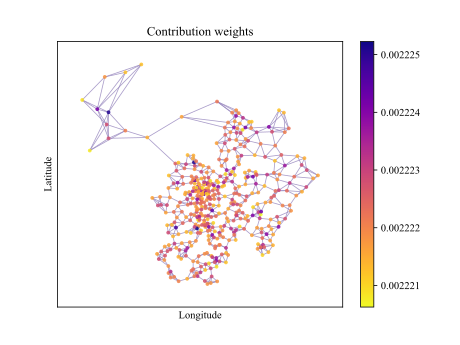
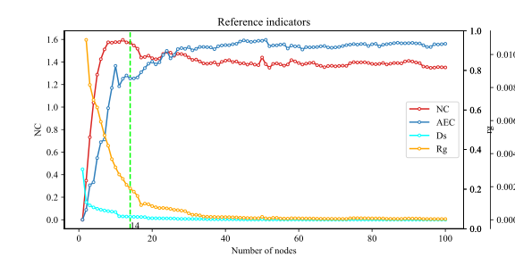
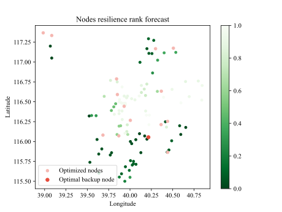
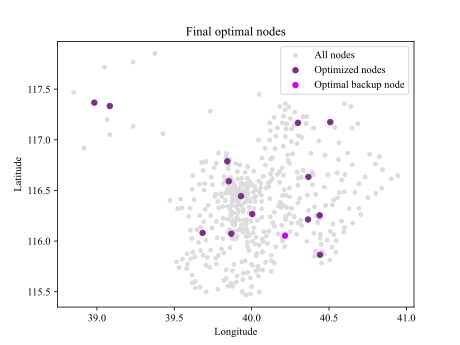

# GSRR: Graph Similarity and Resilience Ranking

> **论文引用**  
> Li C, Du R, Wu J, et al. Resilient Optimization of Sensor Networks Deployment Based on Graph Similarity Learning and Node Resilience Prediction[C]//2025 6th International Conference on Computing, Networks and Internet of Things (CNIOT). IEEE, 2025: 1-5.  
> [论文链接](https://ieeexplore.ieee.org/abstract/document/11070445)

## 摘要

网络弹性（Network Resilience）是指网络在面对故障或对抗性攻击时维持其功能的能力，是网络系统设计与部署中的关键因素。然而，传统的传感器网络优化部署方法往往忽略了这一重要因素。本文提出了一种结合图相似性学习与节点弹性预测的弹性优化方法，用于传感器网络部署，重点提升网络弹性性能。通过策略性地选择并引入最优备份节点，该方法显著增强了网络的整体弹性表现。实验结果表明，该方法在提升网络鲁棒性与能效方面具有显著优势，实现了更高效的备份节点分配。

---

## 工程结构说明

本项目为上述论文的源码实现，主要模块如下：

### 📁 utils
包含项目通用工具函数，分为以下子模块：
- [dataprocess](file://D:\Tjnu-p\Mp\GSRR\utils\dataprocess.py#L0-L0): 数据预处理模块
- [GraphConstruct](file://D:\Tjnu-p\Mp\GSRR\utils\GraphConstruct.py#L0-L0): 图构建相关函数
- [utils](file://D:\Tjnu-p\Mp\GSRR\utils\utils.py#L0-L0): 其他通用工具函数

### 📁 model
模型定义模块：
- [GAT](file://D:\Tjnu-p\Mp\GSRR\utils\model.py#L9-L20): 基于图注意力网络（GAT）的模型实现
- [model_cuda](file://D:\Tjnu-p\Mp\GSRR\utils\model_cuda.py#L0-L0): 支持 CUDA 加速的模型版本
- [model_cuda2](file://D:\Tjnu-p\Mp\GSRR\utils\model_cuda2.py#L0-L0): 改进版 GAT 模型，包含 [NodeEmbeddingModule2](file://D:\Tjnu-p\Mp\GSRR\utils\model_cuda2.py#L106-L172)

### 📁 MGC-RM
多粒度交叉表示与匹配模块（Multi-Granularity Cross Representation and Matching）：
- [perturbation](file://D:\Tjnu-p\Mp\GSRR\MGC-RM\perturbation.py#L0-L0) / [perturbation2](file://D:\Tjnu-p\Mp\GSRR\MGC-RM\perturbation2.py#L0-L0): 生成扰动图
- [MFC_RMF](file://D:\Tjnu-p\Mp\GSRR\MGC-RM\MFC_RMF.py#L0-L0) / [MFC_RMF2](file://D:\Tjnu-p\Mp\GSRR\MGC-RM\MFC_RMF2.py#L0-L0) / [MFC_RMF2cuda2](file://D:\Tjnu-p\Mp\GSRR\MGC-RM\MFC_RMF2cuda2.py#L0-L0): 图相似性训练与预测模块
- [plotpredictloss](file://D:\Tjnu-p\Mp\GSRR\MGC-RM\plotpredictloss.py#L0-L0) / [plotscore](file://D:\Tjnu-p\Mp\GSRR\MGC-RM\plotscore.py#L0-L0): 可视化预测损失与相似度得分
- [PageRank2](file://D:\Tjnu-p\Mp\GSRR\MGC-RM\PageRank2.py#L0-L0): 基于权重的 PageRank 算法
- [Perform](file://D:\Tjnu-p\Mp\GSRR\MGC-RM\Perform.py#L0-L0): 性能评估模块
- `no-readout`: 不含 readout 层的变体实验

### 📁 Resilience
网络弹性评估模块：
- [resilience-cpu](file://D:\Tjnu-p\Mp\GSRR\Resilience\resilience-cpu.py#L0-L0) / [resilience_cuda](file://D:\Tjnu-p\Mp\GSRR\Resilience\resilience_cuda.py#L0-L0): 基于 CPU 和 GPU 的弹性训练与评估
- [resilience_train_test](file://D:\Tjnu-p\Mp\GSRR\Resilience\resilience_train_test.py#L0-L0) / [resilience_eval](file://D:\Tjnu-p\Mp\GSRR\Resilience\resilience_eval.py#L0-L0): 模型测试与评估模块
- [plotscore2](file://D:\Tjnu-p\Mp\GSRR\Resilience\plotscore2.py#L0-L0) / [plotscore-r](file://D:\Tjnu-p\Mp\GSRR\Resilience\plotscore-r.py#L0-L0) / [plotscore-y](file://D:\Tjnu-p\Mp\GSRR\Resilience\plotscore-y.py#L0-L0): 不同指标的可视化分析
- [R-Perform](file://D:\Tjnu-p\Mp\GSRR\Resilience\R-Perform.py#L0-L0): 弹性评估指标计算

---

## 📊 可视化结果

部分实验可视化结果如下：

---

## 🧪 使用说明

请参考各模块下的脚本文件与注释，建议按以下顺序执行：
1. 数据预处理与图构建
2. 模型训练（MGC-RM）
3. 弹性预测与评估（Resilience）

